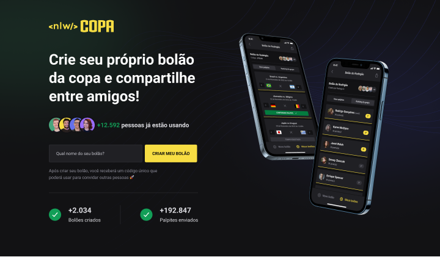
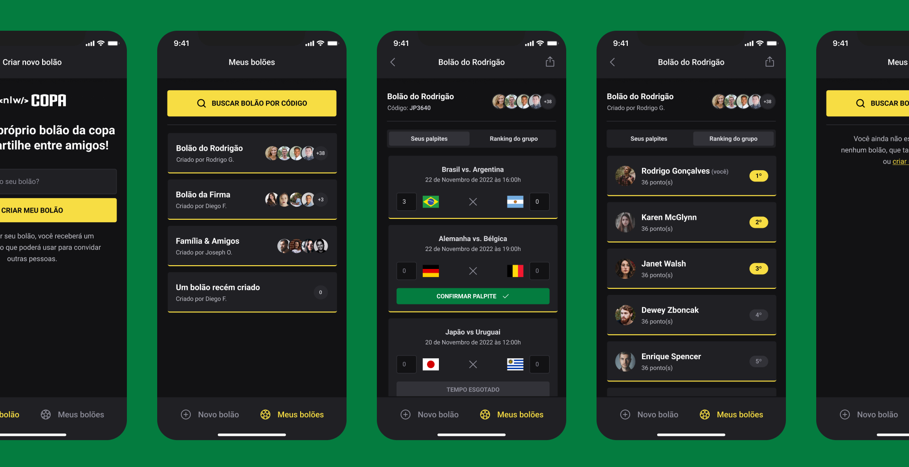

# NLW Copa

Projeto realizando durante a NLW Copa da [Rocketseat](https://www.rocketseat.com.br/ "Rocketseat"), onde foi desenvolvido **Backend**, **Frontend** e **Mobile** de uma aplicação para gerenciar bolões da Copa.

## Source Code

### Server (API)

[Server](https://github.com/dam450/nlw-copa/tree/server "Server")

### Web

[Web](https://github.com/dam450/nlw-copa/tree/web "Web")

### Mobile

[Mobile](https://github.com/dam450/nlw-copa/tree/mobile "Mobile")

